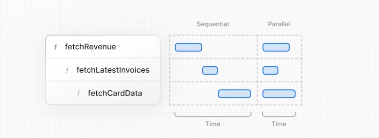
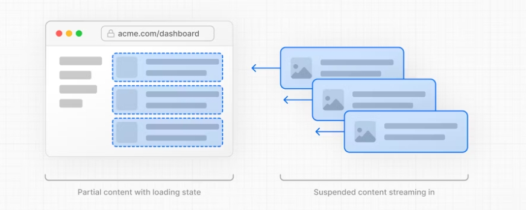
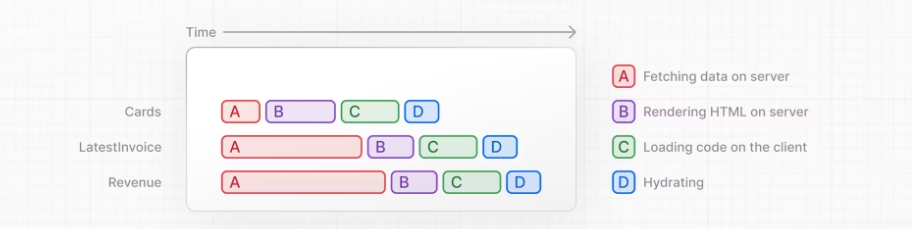

# Next.js

## 起步

### 创建新项目

```cmd
npx create-next-app@latest nextjs-dashboard --use-npm --example "https://github.com/vercel/next-learn/tree/main/dashboard/starter-example"
```

使用create-next-app 创建新的空Next.js项目

### 目录结构

| 名称           |      | 作用                                    |
| -------------- | ---- | --------------------------------------- |
| app            |      | 包含所有路由、组件、逻辑                |
|                | lib  | 包含项目使用功能的方法                  |
|                | ui   | 包含UI组件                              |
| public         |      | 静态资源                                |
| scripts        |      | 脚本                                    |
| next.config.js |      | 配置文件，使用create-next-app会自动生成 |

### Placeholder data

案例数据文件夹，在没有使用数据库时，placeholder-data.js定义了静态案例数据。

TypeScript

后缀为.tx .tsx的文件。definitions.ts定义了数据类型，通过使用TypeScript，你可以确保不会意外地将错误的数据格式传递给组件或数据库，比如传递一个字符串而不是一个数字给发票金额。

```
如果你是一个TypeScript开发者:

我们手动声明数据类型，但是为了更好的类型安全性，我们推荐使用Prisma，它会根据您的数据库模式自动生成类型。
Next.js检测你的项目是否使用TypeScript，并自动安装必要的包和配置。js还为你的代码编辑器提供了一个TypeScript插件，以帮助实现自动完成和类型安全。
```

### Running

```cmd
$ npm i
$ npm run dev
```

## CSS

### 全局样式

项目目录下的/app/ui存在global.css的文件，你可以使用这个文件为应用程序中的所有路由添加CSS规则——比如CSS重置规则、像链接这样的HTML元素的全站样式等等。

你可以在别处导入global.css，但最好还是加在最顶级的组件上，在Next.js，这叫根布局(root layout)。

Add global styles to your application by navigating to `/app/layout.tsx` and importing the `global.css` file

### Tailwind

global.css存在下面几个注解，@tailwind，Tailwind是一个CSS框架，它允许您直接在TSX标记中快速编写实用程序类，从而加快了开发过程。通过使用全局样式，可以传递到每个元素上，可以在操作元素时不用担心是否样式混乱。当使用create-next-app创建项目时Next.js会询问是否添加tailwind。

```typescript
@tailwind base;
@tailwind components;
@tailwind utilities;
```

### CSS.MODULE

在文件中定义CSS格式，在别处中快速引入。例如在Page.tsx页面中

```typescript
import syste from '@/app/ui/home.module.css'
export default function Page() {
return(
    /..
    <div className={syste.shape} />
../
	)
}
```

### CLSX

使用clsx库快速切换class name。在以下代码，当发票状态为pending或paid可显示的样式不一样。

```typescript
import clsx from 'clsx';
 
export default function InvoiceStatus({ status }: { status: string }) {
  return (
    <span
      className={clsx(
        'inline-flex items-center rounded-full px-2 py-1 text-sm',
        {
          'bg-gray-100 text-gray-500': status === 'pending',
          'bg-green-500 text-white': status === 'paid',
        },
      )}
    >
    // ...
)}
```

其他样式解决方法

n addition to the approaches we've discussed, you can also style your Next.js application with:

- Sass which allows you to import `.css` and `.scss` files.
- CSS-in-JS libraries such as [styled-jsx](https://github.com/vercel/styled-jsx), [styled-components](https://github.com/vercel/next.js/tree/canary/examples/with-styled-components), and [emotion](https://github.com/vercel/next.js/tree/canary/examples/with-emotion).

Take a look at the [CSS documentation](https://nextjs.org/docs/app/building-your-application/styling) for more information.

## 优化字体和图片

### [Why optimize fonts?](https://nextjs.org/learn/dashboard-app/optimizing-fonts-images#why-optimize-fonts)

字体在网站设计中扮演着重要的角色，但是在项目中使用自定义字体可能会影响性能，因为需要（从网络或本地）提取和加载字体文件。

当使用next/font模块时Next.js会自动优化代码，它在构建时下载字体文件，并将它们与其他静态资产一起托管。这意味着当用户访问您的应用程序时，没有额外的网络请求字体。

### [Adding a primary font](https://nextjs.org/learn/dashboard-app/optimizing-fonts-images#adding-a-primary-font)

在/app/ui文件夹中创建一个名为fonts.ts的新文件。您将使用该文件来保存将在整个应用程序中使用的字体。

```typescript
import { Inter } from 'next/font/google'
export const inter = Inter({ subsets : ['latin']})
```

添加到layout.ts中的html元素中body设为全局主要字体，同时添加了tailwind的antialiased反锯齿类，使字体变得平滑。没有必要使用这个类，但它增加了一种不错的感觉。

Navigate to your browser, open dev tools and select the `body` element. You should see `Inter` and `Inter_Fallback` are now applied under styles.

```typescript
import '@/app/ui/global.css'
import { inter } from '@/app/ui/font'
export default function RootLayout({
  children,
}: {
  children: React.ReactNode;
}) {
  return (
    <html lang="en">
      <body className='${inter.className} antialiased'>{children}</body>
    </html>
  );
}
```

### [Why optimize images?](https://nextjs.org/learn/dashboard-app/optimizing-fonts-images#why-optimize-images)

Next.js可以在顶层/公共文件夹下提供静态资源，比如图像。/public中的文件可以在应用程序中引用。

With regular HTML, you would add an image as follows:

```html

```

你需要确保以下事项：

- 确保你的图形正确响应不同的屏幕尺寸。
- 定义不同设备的图形尺寸。
- 防止图像加载时布局移位。
- 在用户屏幕视野以外的视图下实现延迟加载。

图像优化在web开发中是一个很大的话题，它本身就可以被认为是一门专业。您可以使用next/image组件来自动优化您的图像，而不是手动实现这些优化。

### [The <Image\> component](https://nextjs.org/learn/dashboard-app/optimizing-fonts-images#the-image-component)

The `<Image>` Component is an extension of the HTML `` tag, and comes with automatic image optimization, such as:

- Preventing layout shift automatically when images are loading.
- Resizing images to avoid shipping large images to devices with a smaller viewport.
- Lazy loading images by default (images load as they enter the viewport).
- Serving images in modern formats, like [WebP](https://developer.mozilla.org/en-US/docs/Web/Media/Formats/Image_types#webp) and [AVIF](https://developer.mozilla.org/en-US/docs/Web/Media/Formats/Image_types#avif_image), when the browser supports it.

## 创建布局和页面

### [Nested routing](https://nextjs.org/learn/dashboard-app/creating-layouts-and-pages#nested-routing)

Next.js uses file-system routing where folders are used to create nested routes.  Each folder represents a route segment that maps to a URL segment.Next.js使用文件系统路由，每一个文件夹映射一个路由地址。


可以使用layout.tsx page.tsx文件分割路由地址，page.tsx是一个特殊的Next.js文件，用于导出一个React组件，它是路由可访问所必需的。在您的应用程序中，您已经有了一个页面文件:/app/page.tsx 这是与路由'/'相关联的主页。


### [Creating the dashboard layout](https://nextjs.org/learn/dashboard-app/creating-layouts-and-pages#creating-the-dashboard-layout)

仪表板具有跨多个页面共享的某种导航。在Next.js中，你可以使用一个特殊的布局。tsx文件创建在多个页面之间共享的UI。让我们为仪表板页面创建一个布局!

在/dashboard文件夹中，添加一个名为layout.tsx的新文件。并粘贴以下代码:

```typescript
import SideNav from '@/app/ui/dashboard/sidenav';
 
export default function Layout({ children }: { children: React.ReactNode }) {
  return (
    <div className="flex h-screen flex-col md:flex-row md:overflow-hidden">
      <div className="w-full flex-none md:w-64">
        <SideNav />
      </div>
      <div className="flex-grow p-6 md:overflow-y-auto md:p-12">{children}</div>
    </div>
  );
}
```

首先，将<SideNav />组件导入到布局中。导入该文件的任何组件都将成为布局的一部分。

<Layout />组件接收一个children属性。这个子节点可以是页面，也可以是另一个布局。在Next.js中使用布局的一个好处是，在导航时，只有页面组件更新，而布局不会重新呈现。这被称为部分渲染。

## 页面间导航

### [Why optimize navigation?](https://nextjs.org/learn/dashboard-app/navigating-between-pages#why-optimize-navigation)

To link between pages, you'd traditionally use the `<a>` HTML element. At the moment, the sidebar links use `<a>` elements, but notice what happens when you navigate between the home, invoices, and customers pages on your browser.

Did you see it?

There's a full page refresh on each page navigation!

### [The `<link>` component](https://nextjs.org/learn/dashboard-app/navigating-between-pages#the-link-component)

在Next.js可以使用<link>组件连接你项目中的页面。<Link>允许您使用JavaScript进行客户端导航。打开/app/ui/dashboard/nav-links.tsx查看以下代码：

```typescript
import {
  UserGroupIcon,
  HomeIcon,
  DocumentDuplicateIcon,
} from '@heroicons/react/24/outline';
import Link from 'next/link';
 
// ...
 
export default function NavLinks() {
  return (
    <>
      {links.map((link) => {
        const LinkIcon = link.icon;
        return (
          <Link
            key={link.name}
            href={link.href}
            className="flex h-[48px] grow items-center justify-center gap-2 rounded-md bg-gray-50 p-3 text-sm font-medium hover:bg-sky-100 hover:text-blue-600 md:flex-none md:justify-start md:p-2 md:px-3"
          >
            <LinkIcon className="w-6" />
            <p className="hidden md:block">{link.name}</p>
          </Link>
        );
      })}
    </>
  );
}
```

link组件近似<a>标签用法，只是把<a href="">改成<Link href="">

### [Automatic code-splitting and prefetching](https://nextjs.org/learn/dashboard-app/navigating-between-pages#automatic-code-splitting-and-prefetching)

为了改善导航体验，Next.js会根据路由段自动对应用进行代码拆分。这与传统的React SPA不同，在传统的React SPA中，浏览器在初始加载时加载所有应用程序代码。

按路由分割代码意味着页面被隔离。如果某个页面抛出错误，应用程序的其余部分仍将正常工作。

此外，在生产环境中，只要<Link>组件出现在浏览器的视图中，Next.js就会自动在后台预取链接路由的代码。当用户单击链接时，目标页面的代码已经在后台加载，这使得页面转换几乎是即时的!

## 设置数据库

### 发布代码到GIT仓库

### [Create a Vercel account](https://nextjs.org/learn/dashboard-app/setting-up-your-database#create-a-vercel-account)

### [Connect and deploy your project](https://nextjs.org/learn/dashboard-app/setting-up-your-database#connect-and-deploy-your-project)

### [Create a Postgres database](https://nextjs.org/learn/dashboard-app/setting-up-your-database#create-a-postgres-database)

### [Seed your database](https://nextjs.org/learn/dashboard-app/setting-up-your-database#seed-your-database)

### 绑定云部署数据库要点

- 将文件中的.env.sample改为.env（不是新建）
- 部署项目到Vercel网站，保存.env.local标签下的内容到项目中的.env
- 运行npm i @vercel/postgres安装pg sdk
- 项目scrpits目录下添加seed.js文件编写建表语句，package.json下的scripts添加"seed": "node -r dotenv/config ./scripts/seed.js"
- 运行npm run seed，开始建表，完成后可在云部署网站上搜索

## 获取数据

#### [Choosing how to fetch data](https://nextjs.org/learn/dashboard-app/fetching-data#choosing-how-to-fetch-data)

**API**

API 是应用程序代码和数据库之间的中间层。 在某些情况下您可能会使用 API：

如果您使用提供 API 的第三方服务。
如果您从客户端获取数据，则需要有一个在服务器上运行的 API 层，以避免将数据库机密暴露给客户端。
在 Next.js 中，您可以使用路由处理程序创建 API 端点。

**访问数据库**

当您创建全栈应用程序时，您还需要编写与数据库交互的逻辑。 对于像 Postgres 这样的关系数据库，您可以使用 SQL 或像 Prisma 这样的 ORM 来完成此操作。

在某些情况下，您必须编写数据库查询：

创建 API 端点时，您需要编写与数据库交互的逻辑。
如果您使用React Server Components（在服务器上获取数据），您可以跳过API层，直接查询数据库，而不必冒将数据库机密暴露给客户端的风险。

#### [Using Server Components to fetch data](https://nextjs.org/learn/dashboard-app/fetching-data#using-server-components-to-fetch-data)

默认情况下，Next.js 应用程序使用 React Server 组件。 使用服务器组件获取数据是一种相对较新的方法，使用它们有一些好处：

服务器组件支持 Promise，为数据获取等异步任务提供更简单的解决方案。 您可以使用 async/await 语法，而无需使用 useEffect、useState 或数据获取库。
服务器组件在服务器上执行，因此您可以将昂贵的数据获取和逻辑保留在服务器上，并且仅将结果发送到客户端。
如前所述，由于服务器组件在服务器上执行，因此您可以直接查询数据库，而无需额外的 API 层。

#### [Using SQL](https://nextjs.org/learn/dashboard-app/fetching-data#using-sql)

使用案例，你可以在任何组件内部使用sql。

```typescript
import { sql } from '@vercel/postgres';
 
// ...
```

#### [What are request waterfalls?](https://nextjs.org/learn/dashboard-app/fetching-data#what-are-request-waterfalls)

A "waterfall" refers to a sequence of network requests that depend on the completion of previous requests. In the case of data fetching, each request can only begin once the previous request has returned data.



#### [Parallel data fetching](https://nextjs.org/learn/dashboard-app/fetching-data#parallel-data-fetching)

在 JavaScript 中，您可以使用 Promise.all() 或 Promise.allSettled() 函数同时发起所有 Promise。可以避免产生'Request waterfalls'


```typescript
export async function fetchCardData() {
  try {
    const invoiceCountPromise = sql`SELECT COUNT(*) FROM invoices`;
    const customerCountPromise = sql`SELECT COUNT(*) FROM customers`;
    const invoiceStatusPromise = sql`SELECT
         SUM(CASE WHEN status = 'paid' THEN amount ELSE 0 END) AS "paid",
         SUM(CASE WHEN status = 'pending' THEN amount ELSE 0 END) AS "pending"
         FROM invoices`;
 
    const data = await Promise.all([
      invoiceCountPromise,
      customerCountPromise,
      invoiceStatusPromise,
    ]);
    // ...
  }
}
```

## 动态渲染

### [What is Dynamic Rendering?](https://nextjs.org/learn/dashboard-app/static-and-dynamic-rendering#what-is-dynamic-rendering)

With dynamic rendering, content is rendered on the server for each user at **request time** (when the user visits the page). There are a couple of benefits of dynamic rendering:

- **Real-Time Data** - Dynamic rendering allows your application to display real-time or frequently updated data. This is ideal for applications where data changes often.
- **User-Specific Content** - It's easier to serve personalized content, such as dashboards or user profiles, and update the data based on user interaction.
- **Request Time Information** - Dynamic rendering allows you to access information that can only be known at request time, such as cookies or the URL search parameters.

### [Making the dashboard dynamic](https://nextjs.org/learn/dashboard-app/static-and-dynamic-rendering#making-the-dashboard-dynamic)

默认情况下，@vercel/postgres 不设置自己的缓存语义。 这允许框架设置自己的静态和动态行为。

您可以在服务器组件或数据获取函数中使用名为unstable_noStore 的 Next.js API 来选择退出静态渲染。 让我们添加这个。

在你的data.ts中，从next/cache导入unstable_noStore，并将其称为数据获取函数的顶部：

```typescript
// ...
import { unstable_noStore as noStore } from 'next/cache';
 
export async function fetchRevenue() {
  // Add noStore() here to prevent the response from being cached.
  // This is equivalent to in fetch(..., {cache: 'no-store'}).
  noStore();
 
  // ...
}
 
export async function fetchLatestInvoices() {
  noStore();
  // ...
}
 
export async function fetchCardData() {
  noStore();
  // ...
}
 
export async function fetchFilteredInvoices(
  query: string,
  currentPage: number,
) {
  noStore();
  // ...
}
 
export async function fetchInvoicesPages(query: string) {
  noStore();
  // ...
}
 
export async function fetchFilteredCustomers(query: string) {
  noStore();
  // ...
}
 
export async function fetchInvoiceById(query: string) {
  noStore();
  // ...
}
```

## Streaming

### [What is streaming?](https://nextjs.org/learn/dashboard-app/streaming#what-is-streaming)

流式传输是一种数据传输技术，允许您将路由分解为更小的“块”，并在准备就绪时将它们逐步从服务器流式传输到客户端。





步骤：将不同的数据区分成小块，分块访问；添加页面的骨架，在某些慢数据还没加载出来时，显示骨架。

## 添加身份验证

### [What is authentication?](https://nextjs.org/learn/dashboard-app/adding-authentication#what-is-authentication)

身份验证是当今许多 Web 应用程序的关键部分。 这就是系统检查用户是否是他们所说的人的方式。

安全网站通常使用多种方式来检查用户的身份。 例如，输入您的用户名和密码后，该网站可能会向您的设备发送验证码或使用 Google Authenticator 等外部应用程序。 这种两因素身份验证 (2FA) 有助于提高安全性。 即使有人知道您的密码，如果没有您的唯一令牌，他们也无法访问您的帐户。

##### [Authentication vs. Authorization](https://nextjs.org/learn/dashboard-app/adding-authentication#authentication-vs-authorization)

在 Web 开发中，身份验证和授权扮演着不同的角色：

身份验证是为了确保用户是他们所说的人。 您正在使用您拥有的用户名和密码等信息来证明您的身份。
授权是下一步。 一旦用户的身份得到确认，授权就会决定他们可以使用应用程序的哪些部分。
因此，身份验证检查您是谁，授权确定您可以在应用程序中执行或访问哪些内容。

鉴权：确认用户是谁

授权：确认用户权限（可以访问什么）

### [Creating the login route](https://nextjs.org/learn/dashboard-app/adding-authentication#creating-the-login-route)

### [NextAuth.js](https://nextjs.org/learn/dashboard-app/adding-authentication#nextauthjs)

我们将使用 NextAuth.js 向您的应用程序添加身份验证。 NextAuth.js 抽象化了管理会话、登录和注销以及身份验证其他方面所涉及的大部分复杂性。 虽然您可以手动实现这些功能，但该过程可能非常耗时且容易出错。 NextAuth.js 简化了流程，为 Next.js 应用程序中的身份验证提供了统一的解决方案。

安装NextAuth依赖

```cmd
npm install next-auth@beta
```

生成应用密钥

```cmd
openssl rand -base64 32
```

在.env文件中加入密钥

```cmd
AUTH_SECRET=your-secret-key
```

添加页面选项

Create an `auth.config.ts` file at the root of our project that exports an `authConfig` object. This object will contain the configuration options for NextAuth.js. For now, it will only contain the `pages` option:

```typescript
import type { NextAuthConfig } from 'next-auth';
 
export const authConfig = {
  pages: {
    signIn: '/login',
  },
};
```

You can use the `pages` option to specify the route for custom sign-in, sign-out, and error pages. This is not required, but by adding `signIn: '/login'` into our `pages` option, the user will be redirected to our custom login page, rather than the NextAuth.js default page.

### [Protecting your routes with Next.js Middleware](https://nextjs.org/learn/dashboard-app/adding-authentication#protecting-your-routes-with-nextjs-middleware)

添加逻辑保护你的路由不被未鉴权的用户访问。

```typescript
import type { NextAuthConfig } from 'next-auth';
 
export const authConfig = {
  pages: {
    signIn: '/login',
  },
  callbacks: {
    authorized({ auth, request: { nextUrl } }) {
      const isLoggedIn = !!auth?.user;
      const isOnDashboard = nextUrl.pathname.startsWith('/dashboard');
      if (isOnDashboard) {
        if (isLoggedIn) return true;
        return false; // Redirect unauthenticated users to login page
      } else if (isLoggedIn) {
        return Response.redirect(new URL('/dashboard', nextUrl));
      }
      return true;
    },
  },
  providers: [], // Add providers with an empty array for now
} satisfies NextAuthConfig;
```

添加中间件文件(/middleware.ts)

```typescript
import NextAuth from 'next-auth';
import { authConfig } from './auth.config';
 
export default NextAuth(authConfig).auth;
 
export const config = {
  // https://nextjs.org/docs/app/building-your-application/routing/middleware#matcher
  matcher: ['/((?!api|_next/static|_next/image|.*\\.png$).*)'],
};
```

### [Adding the Credentials provider](https://nextjs.org/learn/dashboard-app/adding-authentication#adding-the-credentials-provider)

Next, you will need to add the `providers` option for NextAuth.js. `providers` is an array where you list different login options such as Google or GitHub. For this course, we will focus on using the [Credentials provider](https://authjs.dev/getting-started/providers/credentials-tutorial) only.

```typescript
import NextAuth from 'next-auth';
import { authConfig } from './auth.config';
import Credentials from 'next-auth/providers/credentials';
import { z } from 'zod';
 
export const { auth, signIn, signOut } = NextAuth({
  ...authConfig,
  providers: [
    Credentials({
      async authorize(credentials) {
        const parsedCredentials = z
          .object({ email: z.string().email(), password: z.string().min(6) })
          .safeParse(credentials);
      },
    }),
  ],
});
```

添加/auth.js文件

```typescript
import NextAuth from 'next-auth';
import Credentials from 'next-auth/providers/credentials';
import { authConfig } from './auth.config';
import { sql } from '@vercel/postgres';
import { z } from 'zod';
import type { User } from '@/app/lib/definitions';
import bcrypt from 'bcrypt';
 
// ...
 
export const { auth, signIn, signOut } = NextAuth({
  ...authConfig,
  providers: [
    Credentials({
      async authorize(credentials) {
        // ...
 
        if (parsedCredentials.success) {
          const { email, password } = parsedCredentials.data;
          const user = await getUser(email);
          if (!user) return null;
          const passwordsMatch = await bcrypt.compare(password, user.password);
 
          if (passwordsMatch) return user;
        }
 
        console.log('Invalid credentials');
        return null;
      },
    }),
  ],
});
```

最后，在登录页面添加form表单的提交动作和登出操作。

## 添加元数据

在 Web 开发中，元数据提供有关网页的其他详细信息。 访问该页面的用户看不到元数据。 相反，它在幕后工作，嵌入到页面的 HTML 中，通常在 <head> 元素中。 这些隐藏信息对于搜索引擎和其他需要更好地了解网页内容的系统至关重要。

参考案例：https://nextjs.org/learn/dashboard-app/adding-metadata